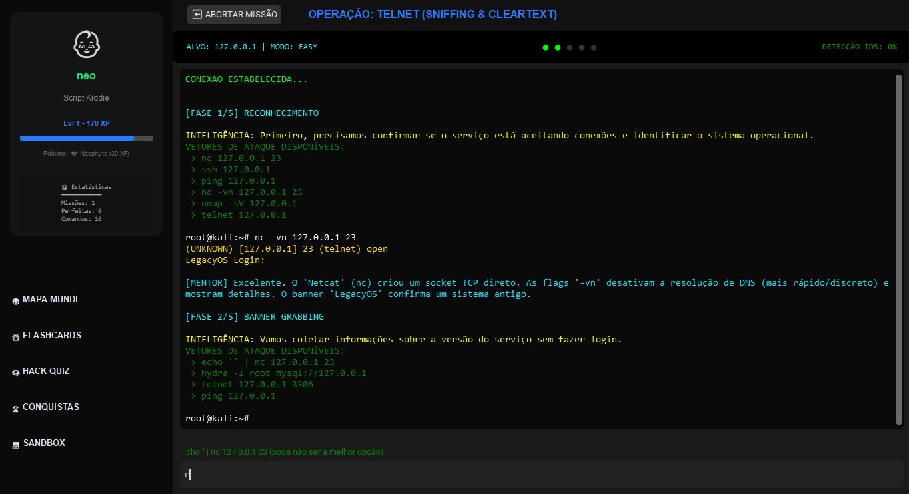
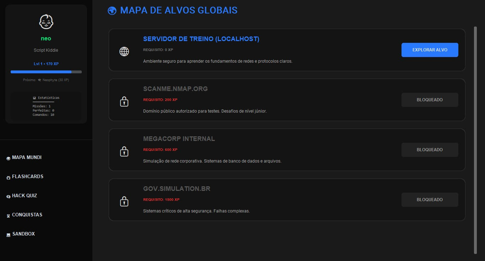

# 🛡️ ShadowShell: Offensive Security Simulator



> *Formerly known as ShadowShell*

## Descrição Técnica

**ShadowShell** é uma plataforma educacional interativa de simulação de cibersegurança, desenvolvida em Python com interface gráfica `CustomTkinter`. O sistema implementa um ambiente controlado para aprendizado prático de técnicas de pentest, combinando gamificação avançada com simulação realista de sistemas operacionais e redes.

A arquitetura utiliza um **Filesystem Virtual (VFS)** independente de SO para simulação segura de comandos Linux, um motor de gamificação baseado em JSON para persistência de progresso, e um sistema de detecção **IDS (Intrusion Detection System)** para treinamento em OPSEC.

---

## 🚀 Key Features

### 🗂️ Simulated File System (VFS)
- **Arquitetura Segura**: Simula estrutura de diretórios Linux (`/etc`, `/bin`, `/home`) sem interagir com o disco real da máquina.
- **Comandos Nativos**: Implementação lógica de `ls`, `cat`, `cd`, `grep`, `find`, `chmod` com flags reais.
- **Sandboxing**: Prevenção total de execução de comandos perigosos no ambiente host.

### 🎮 Motor de Gamificação
- **Sistema XP Progressivo**: Níveis baseados em experiência acumulada (200 XP por nível).
- **Career Path**: Evolução de ranks de "Script Kiddie" até "Cyber God".
- **Achievements**: Sistema de conquistas baseada em padrões de observador (Observer Pattern).
- **Persistência**: Salvamento automático em JSON (`student_save.json`).

### 🕵️ Stealth & OPSEC Mechanics
- **IDS Simulation**: Barra de detecção que reage a comandos "barulhentos" (ex: scans agressivos).
- **Risk Management**: Falha na missão caso a detecção atinja 100%.
- **Feedback Loop**: O sistema explica tecnicamente por que um comando foi detectado.

---

## 📸 Screenshots

| Dashboard Gamificado | Terminal Sandbox |
|:---:|:---:|
|  |  |

---

## 🛠️ Tech Stack

- **Core**: Python 3.11+
- **GUI Framework**: CustomTkinter 5.2.0
- **Image Processing**: Pillow (PIL) 10.0.0
- **Concurrency**: Python `threading` (para ferramentas de rede non-blocking)
- **Architecture**: Modular (Separação entre GUI, Logic e Data)

---

## 📂 Estrutura do Projeto

```text
ShadowShell/
├── main.py              # Entry Point & Navegação
├── windows.py           # Lógica do Terminal e Missões (VFS & Threads)
├── gamification.py      # Engine de XP e Achievements
├── data.py              # Banco de dados estático (Missões/Ferramentas)
├── config.py            # Constantes de UI e Temas
├── gui_components.py    # Widgets customizados
├── utils.py             # Helpers de imagem e animação
├── requirements.txt     # Dependências
├── .gitignore           # Ignorar arquivos de sistema/logs
└── img/                 # Assets visuais (Screenshots)

📥 Instalação e Uso
Pré-requisitos
Python 3.10 ou superior

Git

Instalação
Bash
# 1. Clone o repositório
git clone [https://github.com/Cod-hash/ShadowShell.git](https://github.com/Cod-hash/ShadowShell.git)
cd ShadowShell

# 2. Crie um ambiente virtual (Opcional, mas recomendado)
python -m venv venv
# Windows:
venv\Scripts\activate
# Linux/Mac:
source venv/bin/activate

# 3. Instale as dependências
pip install -r requirements.txt
Executando
Bash
python main.py

🤝 Contribuição
Contribuições são bem-vindas para adicionar novas missões ou ferramentas simuladas!

Fork o projeto

Crie uma branch (git checkout -b feature/nova-tool)

Commit suas mudanças (git commit -m 'Add: Simulação do Wireshark')

Push para a branch (git push origin feature/nova-tool)

Abra um Pull Request

⚖️ Aviso Legal
Este software é exclusivamente educacional. O ShadowShell é um simulador e não realiza ataques reais a redes externas. Todas as ferramentas e IPs apresentados são simulados internamente no código.

Desenvolvido por Marco | Focado em Cibersegurança e Desenvolvimento Seguro.